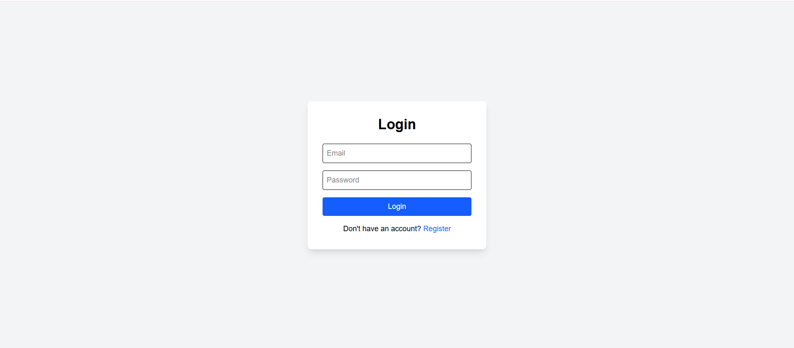
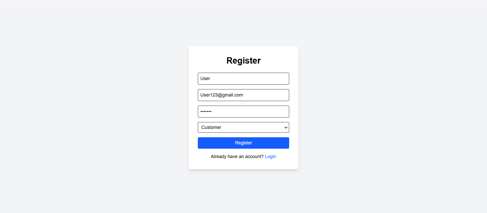
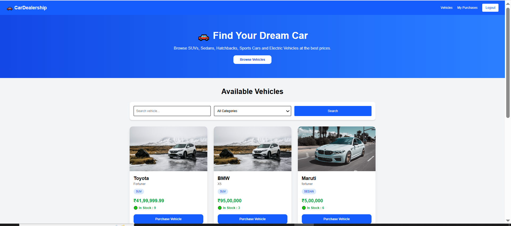
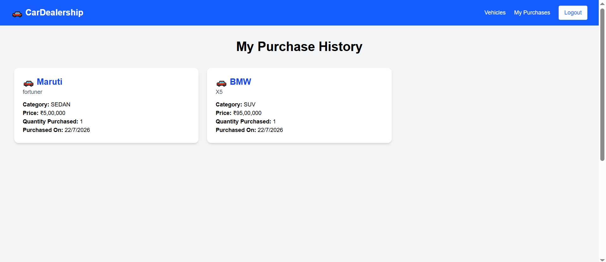
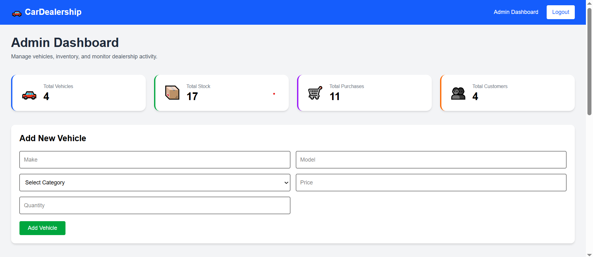
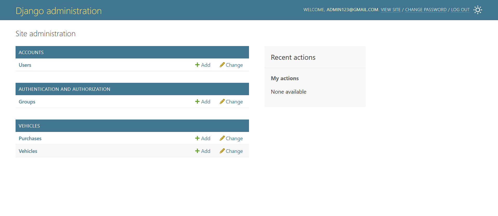

# 🚗 Car Dealership Management System

A full-stack Car Dealership Management System developed using **Django REST Framework** and **React.js**. The application allows customers to browse and purchase vehicles while providing administrators with inventory management features.

---

## 📌 Features

### 👤 Customer

- User Registration
- User Login using JWT Authentication
- View all available vehicles
- Search vehicles
- Filter vehicles by category
- Purchase vehicles
- View purchase history
- Responsive dashboard

### 👨‍💼 Admin

- Secure Admin Login
- Add new vehicles
- Update vehicle details
- Delete vehicles
- Restock vehicle inventory
- Dashboard statistics
- Manage vehicle inventory

---

## 🛠 Tech Stack

### Frontend

- React.js
- Tailwind CSS
- Axios
- React Router DOM

### Backend

- Django
- Django REST Framework
- JWT Authentication
- Django Filters

### Database

- SQLite

---

## 📂 Project Structure

```
car-dealership-system/

│── backend/
│   ├── accounts/
│   ├── vehicles/
│   ├── config/
│   ├── manage.py
│
│── frontend/
│   ├── src/
│       ├── components/
│       ├── context/
│       ├── pages/
│       ├── services/
│
└── README.md
```

---

## ⚙️ Installation

### Clone the repository

```bash
git clone <repository-url>
```

---

### Backend Setup

```bash
cd backend

python -m venv venv

venv\Scripts\activate

pip install -r requirements.txt

python manage.py migrate

python manage.py createsuperuser

python manage.py runserver
```

---

### Frontend Setup

```bash
cd frontend

npm install

npm run dev
```

---

## 🔑 Authentication

The project uses **JWT Authentication**.

After login:

- Access Token
- Refresh Token

are stored in Local Storage and used for authenticated API requests.

---

## 🚙 Vehicle Features

- Vehicle Listing
- Search
- Filter
- Purchase
- Stock Management
- Restocking

---

## 📊 Admin Features

- Dashboard Statistics
- Vehicle CRUD Operations
- Inventory Management

---

## 📷 Screenshots

### Login Page



---

### Register Page



---

### Customer Dashboard



---

### Purchase History



---

### Admin Dashboard

#### Dashboard Overview



#### Vehicle Management

.png)

---

### Django Admin



---

## 🔮 Future Enhancements

- Vehicle Images Upload
- Online Payment Integration
- Wishlist
- Email Notifications
- Order Tracking

---

## 👩‍💻 Developed By

Asmita Rathod

BE Information Technology

LD College of Engineering
